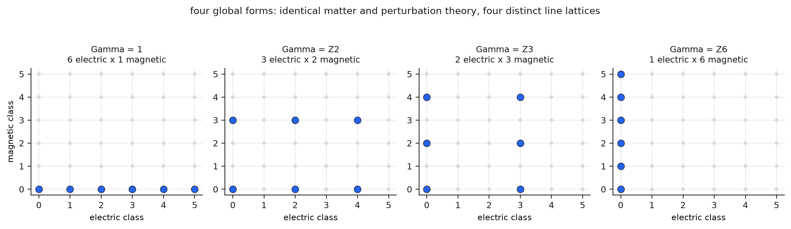

## Abstract

Candidate criteria for the indivisibility of the electron fail: experiment bounds structure only down to its resolution. An irreducible representation label is also carried by the proton, a spin-half irreducible state made of quarks. Appearing as an elementary field depends on the presentation, since exact dualities exchange elementary fields with composites. The physical electron is also an infrared-dressed sector that no bare Wigner particle describes. We organize these obstructions into a research programme. Its starting point is a set of 2026 results: the exact Standard Model gauge group, including its global Z6 quotient, arises as a stabilizer inside the automorphisms of the exceptional Jordan algebra; the chiral content of one generation follows from Peirce decompositions of a Jordan pair; and e7 contains three generation-shaped spaces. We define a flagged Jordan-spectral kernel and its quantum completion M, quotiented by renormalization and exact duality, and state emergence as a classification problem whose axioms may not encode 3, 2, 1 or 16. In exact rational arithmetic, the 16-state generation satisfies all 5 consistency conditions, and deleting any multiplet except the right-handed neutrino breaks at least one. The 4 global forms of the gauge group, built as explicit line lattices, share identical matter. The SL(2,Z) orbit of the unit electric charge is the set of coprime vectors (density 0.598, against $6/\pi^2$ asymptotically), each decomposable into nonzero charges. In SU(2) fusion every irreducible is tensor-prime and every spin above one half is a summand of a product of smaller spins, so tensor-primality detects nothing. These results motivate a 7-level hierarchy of atomicity and an electron conjecture whose scope is limited to M.

## Introduction

Democritus named the atom for what could not be cut. Physics has kept the word without a criterion, because every operational meaning of "cannot be cut" has failed. We ask what a defensible criterion would look like, how far the mathematics available in 2026 goes toward one, and what remains conjecture. Four obstructions define the problem.

The first is finite resolution. No experiment establishes the absence of structure at all smaller scales; the electron is pointlike down to the shortest distances probed, which is a statement about the probes. The second is the proton. As a one-particle state it furnishes an irreducible representation of the Poincaré group, with the proton's mass and spin one half, in the classification where a particle is an irreducible unitary representation labeled by mass and spin [@wigner1939]. It is also three quarks and gluons. An irreducible label therefore cannot certify a noncomposite carrier, and any argument from the electron's labels to its indivisibility fails on this example. The third is duality. In supersymmetric gauge theories, exact equivalences map a composite operator of one description to an elementary field of the dual description [@seiberg1995; @fang2024], and electric-magnetic duality, the oldest form of the phenomenon, exchanges elementary electric quanta with solitonic monopoles [@montonen1977]. Being an elementary field is a property of a particular Lagrangian. The fourth is dressing. A charged particle in quantum electrodynamics cannot be separated from its cloud of arbitrarily soft photons; the physical charged state is an infraparticle without a sharp mass shell, as a theorem establishes [@frohlich1979; @buchholz1986; @duch2023]. Any candidate for an indivisible electron must be the dressed sector and not the bare field.

Together the obstructions specify the requirements. A meaningful claim of indivisibility must concern an object and not a label, be stated in a category and not a Lagrangian, be invariant under every exact duality, and apply to the dressed sector. The algebraic framework already meets the first two conditions: superselection sectors form a tensor category whose product encodes how charges compose [@doplicher1971], and the global gauge group can be reconstructed from that category [@doplicher1989]. No existing framework meets the third and fourth conditions while producing the Standard Model as output. We call the conjectural structure that would do so M. No single presentation would reveal such an object; only its spectra, observables, defects, dualities and low-energy phases would be observable.

## Recent results on exceptional Jordan algebras and the Standard Model

Three results from 2026 place the kinematic starting point of the programme on established ground. We state them as their authors do.

The first concerns the gauge group. Baez and Schwahn proved that inside the automorphism group of the exceptional Jordan algebra h3(O), the stabilizer of a qubit-sized subalgebra, intersected with the identity component of the stabilizer of a qutrit-sized subalgebra, is isomorphic to S(U(2)×U(3)), which equals [SU(3)×SU(2)×U(1)]/Z6, the Standard Model gauge group in its exact global form including the Z6 quotient [@baez2026b]. In their description, the Standard Model gauge group consists of the symmetries of an octonionic qutrit that act as unitary operators on an ordinary qutrit and, within it, on a qubit. The algebra is the one exceptional object in the 1934 classification of Jordan, von Neumann and Wigner, found during an attempt to reformulate quantum mechanics algebraically and without a physical application for ninety-two years [@jordan1934].

The second concerns matter. Baez, Bokor and Boyle showed that a chain of Peirce decompositions along a compatible flag of tripotents, descending from the complexified exceptional algebra through the bi-Cayley space to the 3-by-2 complex matrices, yields a 16-complex-dimensional space that decomposes under the residual group into the six multiplets of one Standard Model generation in left-handed Weyl form, with correct hypercharges and a right-handed neutrino [@baez2026c]. The authors state that the tripotents are chosen and not derived, and that the construction's threefold triality structure has not yielded three generations.

The third concerns families. Baez showed that e7 decomposes into a subalgebra plus three 32-dimensional spaces, each transforming as one generation of fermions and their antiparticles, in a setting he credits to Nasmith, with mathematics going back to the E7 unification of Kugo and Yanagida; he presents the result as representation theory with a chosen embedding and not as a physical theory [@baez2026]. The lineage of all three results runs from octonionic quark structure [@gunaydin1973] through the survey of exceptional structures [@baez2002] to exceptional quantum geometry [@duboisviolette2016; @duboisviolette2019].

The established results are the exact global gauge group as a stabilizer, the representation content of one generation from a chosen flag, and three generation-shaped spaces in e7. Absent are any dynamics that selects the flag, the Higgs and Yukawa sector, three physical generations, and a quantum theory. The programme consists in closing the gap between the two lists.

## The kernel and its quantum completion

The following is a proposed architecture. The finite kernel is a flagged exceptional Jordan structure with spectral data: the algebra, a real form, its cubic norm, a compatible tripotent flag, and a finite Hilbert space with charge conjugation, chirality and a finite Dirac operator, which carries whatever masses and Yukawa couplings the kernel can express. Spectral geometry provides the template. In the noncommutative construction of the Standard Model, the gauge and Higgs fields arise as inner fluctuations of a finite Dirac operator and the action follows from a spectral principle [@chamseddine1997], although generations and Yukawa couplings are inserted by hand [@devastato2019]; extensions of that machinery to exceptional and Jordan settings are under construction [@farnsworth2025]. The kernel proposal reverses the usual order: the Jordan flag should generate the spectral data, where the noncommutative construction starts from the Standard Model algebra.

The completion M is the quantum object the kernel would generate: observables assigned to regions in the sense of factorization algebras [@costello2023], sectors and defects, anomaly data with a chosen trivialization [@garciaetxebarria2018], and renormalization flow, followed by a quotient by every exact duality, so that two Lagrangians presenting the same observables, sectors, defects, anomalies and flow define the same point of M. The quotient is the essential step, because it makes "elementary in presentation P" inexpressible as a property of M.

Emergence is defined through a classification problem. Admissible kernels satisfy structural axioms (positivity, chirality, anomaly trivializability, a stable symmetry-breaking vacuum and no massless exotics), and the axioms may not contain the numbers 3, 2, 1 or 16 in disguise. The reconstruction proceeds in stages: the gauge Lie algebra, the exact global group, the chiral matter, the classical action, the quantum theory, the unique ultraviolet completion, and finally the duality-invariant atomicity of the electron. The 2026 results reach the second and third stages. The central classification conjecture, that the exceptional kernel is an isolated admissible point, would turn the observation that the Standard Model fits exceptional mathematics into the statement that every admissible structure is the Standard Model, which is what a derivation would require. Nothing of this kind is proved, and the aim here is to state the conjecture precisely enough that it can fail.

## Anomaly cancellation in one generation

All computations below use exact integer and rational arithmetic with no numerical tolerance. The first concerns the generation itself: sixteen left-handed Weyl states in six multiplets, with hypercharges one sixth, one third, minus two thirds, minus one half, one and zero. There are five consistency conditions: the two mixed gauge anomalies, the cubic hypercharge anomaly, the mixed gravitational anomaly, and the Witten condition requiring an even number of SU(2) doublets. All five vanish identically as exact sums of fractions, with 4 doublets counted (Figure 1, left).

The generation is also rigid. Deleting a single multiplet and recounting, the quark doublet's removal breaks 5 conditions, the lepton doublet's 4, the up and down conjugates' 3 each, and the electron conjugate's 2. Only the deletion of the right-handed neutrino, a singlet under every factor with hypercharge zero, breaks none (Figure 1, right). The generation is thus anomaly-rigid at every site except the one multiplet that has not been established experimentally. The Peirce construction includes this multiplet, and the anomaly count explains why physics could leave its existence open. A structure that produces the 16-state pattern therefore reproduces a near-unique solution of a system of Diophantine conditions, with one free site among six.

{width=100%}

## Global forms of the gauge group

The gauge Lie algebra does not determine the theory. The center classes of SU(3)×SU(2)×U(1) form the group Z3×Z2×Z6, and the six matter multiplets occupy classes that generate a Z6 inside it; the computation confirms that all six lie on the single diagonal generated by the class of the quark doublet. There are therefore four global forms, the quotients by the subgroups of Z6, and we build all four as explicit charge lattices. Every multiplet is admissible under every form, so particle content, perturbation theory and every scattering amplitude built on them coincide across the four. They differ in extended operator content. The allowed Wilson and 't Hooft line classes form lattices of sizes 6 by 1, 3 by 2, 2 by 3 and 1 by 6, each with an integral Dirac pairing, and the four lattices are pairwise distinct (Figure 2). Four theories with one matter content are distinguishable only by which probes exist, the modern form of Tong's observation that experiment has not chosen among them [@tong2017].

The Jordan results therefore carry physical content at this point. The stabilizer theorem produces S(U(2)×U(3)), the full Z6 quotient, which is one of the four lattices and one of the four theories. A structure that selects the global form makes a claim about which magnetic monopoles exist, and the claim has a dual side: the magnetic lattice of each form is the electric lattice of its Goddard-Nuyts-Olive dual group [@goddard1977], the group that number theory independently named the Langlands dual. The rigorous connection between S-duality and the Langlands correspondence is established in twisted supersymmetric Yang-Mills theory, where Wilson and 't Hooft operators are exchanged under the dual group [@kapustin2007]; the modern spectral reading of the correspondence describes decomposition into atomic, monochromatic pieces [@benzvi2026], and its boundary form pairs dual Hamiltonian spaces [@benzvi2024]. None of this machinery applies to the Standard Model as it stands, as the sources state. The conjecture we state is limited: the global form selected by the kernel, with its computed electric and magnetic lattices, is the invariant that a protected sector of any completion M must present to its dual description. At present the Langlands-dual content attached to the electron is a 6-by-6 grid of allowed charges, computed in the simulation.

{width=100%}

## Failure of label-based criteria for indivisibility

Before defining stronger notions, we compute the failure of three criteria based on labels.

The first criterion is primitive charge. In the abelian theory with electric and magnetic charges, the duality group SL(2,Z) acts on charge vectors, and by Bézout's identity the orbit of the unit electric charge consists of the primitive vectors, those with coprime entries. The simulation verifies this constructively over charges up to 40 in absolute value, constructing an explicit determinant-one matrix for each of the 3,920 primitive vectors among 6,560, a density of 0.598 against the asymptotic value $6/\pi^2 = 0.6079$ (Figure 3, left). The statement that the electron's charge is a primitive lattice vector is therefore duality-invariant. It says nothing about the carrier: each primitive vector is exhibited as a sum of two nonzero charge vectors, since charge arithmetic always permits decomposition, and a bound state of constituents whose charges sum to a primitive vector carries the primitive label.

The second criterion is simplicity. A simple object of the sector category, one without internal direct-sum structure, can still be a channel of a composite. In SU(3) the product of two fundamentals contains no singlet, and the product of three contains exactly one, from the decomposition 3 × 3 × 3 = 1 + 8 + 8 + 10, verified by weight-multiset arithmetic with the dimension check summing to 27 (Figure 3, middle). The unique singlet channel is the proton, a simple, irreducible, color-neutral object consisting of three quarks. Simplicity excludes internal sectors and does not exclude constituents.

The third criterion is tensor-primality: an object is tensor-prime if it factors as a tensor product only trivially. The criterion resembles the Greek one and is empty where it would be needed. In the fusion ring of SU(2), no irreducible above the trivial one factors as a tensor product of smaller nontrivial irreducibles, verified exhaustively through dimension 8, so every irreducible is tensor-prime. Every spin above one half also occurs as a summand of a product of smaller spins, for example spin one inside the product of two spin-one-half representations, verified for all of them (Figure 3, right). Both facts hold because a bound state is a summand of a tensor product and never a factor: a composite occurs inside $A \otimes B$ as a channel and is never equal to $A \otimes B$. Tensor-primality therefore tests the wrong operation, and a useful notion of atomicity must quantify over bound-state constructions, condensations and confinement functors, the maps that carry constituents to channels.

{width=100%}

## A hierarchy of atomicity and the electron conjecture

These failures motivate a hierarchy of 7 levels. An object is label-primitive if its charge vector is primitive, which holds for the electron and has no force alone. It is irreducible in the Wigner sense, a property shared with the proton. It is sector-simple if its endomorphisms in the sector category are trivial. It is fusion-prime if it has no tensor factorization, which is generically vacuous as shown above. It is bound-state atomic if it lies outside the essential image of every admissible bound-state, condensation or confinement construction internal to the theory; this is the first level that excludes the proton, which lies in the image of such a construction applied to quarks. It is duality-atomic if it is bound-state atomic in every exact presentation of M, so that no dual description exhibits it as a composite; this is the first level that survives the Seiberg obstruction. It is UV-atomic if it is duality-atomic in every admissible ultraviolet completion, the closest mathematical counterpart of the Greek term.

The object to which these predicates apply is constructed in stages. Before electroweak symmetry breaking there is no electron, only a lepton doublet and a charged singlet in different chiral representations. The Yukawa coupling through the Higgs vacuum binds them into one massive Dirac sector, which we write schematically as a cone over the vacuum-mediated map between the two chiral objects; the notation describes the assembly and does not claim a completed construction. The massless photon then dresses every charged state, and the theorem that charged sectors lack a sharp mass shell [@frohlich1979] makes the physical object the dressed sector, defined through infrared regulators and their controlled removal. The electron conjecture states that the dressed post-electroweak electron sector is bound-state atomic in M and remains so under every exact duality of M. It is not proved. Every term in it is now defined, the hierarchy locates it, and the computed counterexamples show why each weaker statement is empty. If some completion of M presented the dressed electron as a bound channel of another sector, elementarity would prove to be a property of the presentation.

## Conjectures and failure criteria

The programme consists of seven conjectures. Reconstruction: the exceptional kernel is an isolated point among admissible kernels whose axioms do not encode the target numbers. Higgs: the kernel's differential calculus produces exactly one electroweak doublet as a fluctuation of the finite Dirac operator, with no unwanted light scalars. Family index: some internal operator has index 3, producing three simultaneous generations with nontrivial mixing, as opposed to three embeddings of one. Global form: quantum consistency uniquely selects the Z6 quotient and its computed line lattice. Infrared: around a dynamically selected Peirce vacuum, the low-energy theory is the Standard Model plus suppressed corrections. Langlands: the selected lattice is the invariant presented to any protected dual description. Atomicity: the dressed electron conjecture above.

Because exceptional mathematics is especially vulnerable to retrospective pattern-matching, the programme specifies how it fails. If the axioms encode 3, 2 or 16 in disguise, there is no derivation. If many inequivalent flags give equally viable worlds, there is no selection. If the flag must always be chosen by hand, the Standard Model was inserted through the choice. If the spectral calculus cannot produce the Higgs sector, the kernel is representation theory only. If three generations remain an external multiplicity, the most important structural number is unexplained. If anomalies cannot be trivialized, there is no quantum theory. If the Langlands component never constrains a defect lattice beyond the one computed here, it adds nothing. If electron atomicity changes under an exact duality, elementarity depends on the presentation. If no observable consequence follows beyond reproducing known numbers, the construction is a reformulation.

## Objections

The strongest objection is numerological: exceptional structures are large, the Standard Model is specific, and a determined search of large structures finds specific things. The 2026 results answer it in part, because a stabilizer theorem that recovers the exact global quotient and a Peirce chain that recovers all six multiplets with correct hypercharges are single constructions and not scans, and the anomaly computation shows how overdetermined the target is, a Diophantine system rigid at five of six sites. The objection still applies to the flag: until a dynamics selects the tripotents, the construction remains a coincidence, as the status lists above record.

A second objection holds that the no-go results undermine the programme's endpoint: if labels, simplicity and primality all fail, atomicity may be the wrong concept. The failures identify the quantifiers the concept needs, over bound-state constructions and over presentations, and the Doplicher-Haag-Roberts tradition shows that quantifying over a sector category is mathematically tractable [@doplicher1989].

A third objection is that the Langlands material attaches a famous name to speculation. Its use is minimal, one computed lattice and one conjecture, and the supersymmetric setting of the rigorous results is stated each time they are mentioned. Where the dual content cannot be computed, it is not invoked.

A fourth objection is that nothing here is a physical prediction. The global form is one. The four theories of Figure 2 differ in their monopole and dyon spectra, and a kernel that selects the Z6 quotient commits to one column of allowed magnetic charges. This is a falsifiable structural commitment, though not a prediction of a cross-section.

## Falsification

The programme fails under the criteria above, and the computations here fail on narrower grounds. The anomaly computation fails if any of the five sums is nonzero under the stated conventions, or if a deletion other than the right-handed neutrino leaves all conditions intact, since the rigidity claim is exact. The global-form computation fails if the six matter classes do not generate a Z6, if some multiplet is inadmissible under some form, or if the four lattices are not distinct, each a finite check reproduced by the simulation. The SL(2,Z) result is a theorem, so what could fail is its relevance: a demonstration that duality-primitive labels imply indivisible carriers in some class of theories would overturn the no-go and simplify the hierarchy. The claim that bound states are summands and not factors fails if a physical bound-state construction is exhibited whose output is a tensor factor, which would restore fusion-primality as a criterion. The central conjecture, that the exceptional kernel is isolated among admissible kernels, could be refuted by a classification computation, which is why it is stated as a conjecture with the moduli problem specified.

## Relativity of atomicity

Suppose every step succeeds: the kernel is classified and isolated, the flag is selected by dynamics, the Higgs is produced, the families are indexed, the quantum completion is built, the dualities are quotiented, and the dressed electron is proved bound-state atomic in every presentation of M. The theorem would state that within M the electron has no constituents. It would not exclude a deeper theory beneath M in which the prime object of M is the infrared limit of something composite, in the way the proton is elementary in its own effective theory and three quarks in the ultraviolet. Primality is relative to the category in which composition is defined. Only a uniqueness theorem about M itself, that the complete observable structure admits no inequivalent completion, would remove this relativity, and no current result in mathematics or physics approaches such a statement. The endpoint of the programme is therefore conditional. The mathematics of 2026 makes it possible to state in computable terms what an indivisible electron would be: a distinguished object in a uniquely reconstructed category, outside the image of every bound-state functor, invariant under every duality, and carrying the one charge lattice the kernel selects. Whether the electron is such an object is open.

## Reproducibility

The simulation, its 3 figures and every model number quoted above regenerate from one command in the repository (`simulation/run_all.py`). All arithmetic is exact integer and rational, and reruns are identical bit for bit. 17 invariants fail the run if broken, among them the five consistency sums vanishing identically, the deletion-rigidity count with the right-handed neutrino as the unique free site, the Z6 screening subgroup generated by the matter classes, the admissibility of all six multiplets under all four global forms with electric and magnetic orders multiplying to 6 and integral Dirac pairing, the constructive coprimality of the SL(2,Z) orbit with the primitive density within 2 percent of $6/\pi^2$, the unique singlet in the triple product of color fundamentals with its dimension check, and universal tensor-primality alongside universal summand-compositeness in the SU(2) fusion ring.

## References
